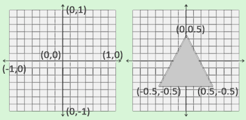

# Hello Triangle
## OpenGL Pipeline
The main job for OpenGL is to transform all the 3D coordinates to 2D pixels that fit on the screen. This process is made in the OpenGL graphics pipeline. The 3D coordinates passed to the pipeline are transformed into 2D colored pixels. The graphics pipeline can be divided into multiple steps. The processing cores run programs on the GPU for each step of the pipeline. Theses small programs are called ***shaders***.

Below is the abstract representation of the pipeline. The blue sections represent sections where we can inject out own shader programs.


As input to the graphic pipeline we pass a list of three 3D coordinates that should form a triangle. We called this array Vertex Data.

> In order for OpenGL to know what to make of the collection of coordinates and color values, OpenGL requires you to hint the render type. Those hints are called primitive and some of them are **GL_POINT**, **GL_TRIANGLE** and **GL_LINE_STRIP**.

The first part of the pipeline is the **vertex shader**. This shader takes as input a single vertex. This stage handles the processing of individual vertices.

The output of the vertex shader is optionally passed to the **geometry shader**. The geometry shader takes as input a collection of vertices that form a primitive and has the ability to generate other shapes by emitting new vertices to form new primitives.

The **primitive assembly** stage takes all the vertices from the vertex or geometry shader as input and forms a primitive shape.

The output of the primitive assembly stage is passed to the **rasterization stage** where it maps the resulting primitive to the corresponding pixels on the screen. The output of this stage are fragments, which are then passed to the fragment shader. Before the fragment shader runs, clipping is performed. Clipping is when the fragments outside the screen are discarded for better performance.

> A fragment is all the information OpenGL needs to render a single pixel.

The main purpose of the fragment shader is to calculate the final color of the pixel to be rendered. This is where usually the advance OpenGL effects take place since the fragment contains all the data like the light, shadow, light color, etc.

In modern OpenGL, it is required to define at least a vertex and a fragment shader of our own. For this reason, it is really difficult to start learning graphics programming.

### Vertex input

The first thing to do to start drawing a triangle is to define the vertices. Since OpenGL works with 3D coordinates, we need to provide the x, y and z values. Not only that, those values need to be in Normalized Device Coordinated (NDC). This coordinates range from -1 to 1 in all three values.



This is an example of vertex information

```c++
float vertices[] = {
    -0.5f, -0.5f, 0.0f,
     0.5f, -0.5f, 0.0f,
     0.0f,  0.5f, 0.0f
};
```

This information is then sent to the first step of the OpenGL pipeline, the vertex shader. To do this, we need to create memory on the GPU to store the vertex data, configure OpenGL how it should interpret the data and specify how to send that into the graphics card.

To do all this, we need to use vertex buffer object (VBO). This is used because it is really slow to send data from the cpu to the gpu, so we try to send as much data as posible so that the gpu has instant access to the information.

This buffer has a unique id, so we can create it using glGenBuffers function.

```c++
unsigned int VBO;
glGenBuffers(1, &VBO);
```

OpenGL has a lot of different buffer types and the vbo is a GL_ARRAY_BUFFER. OpenGL lets us bind to several buffers at once only if they are different types. To bind the vbo, we use glBindData.

```c++
glBindBuffer(GL_ARRAY_BUFFER, VBO);  
```

